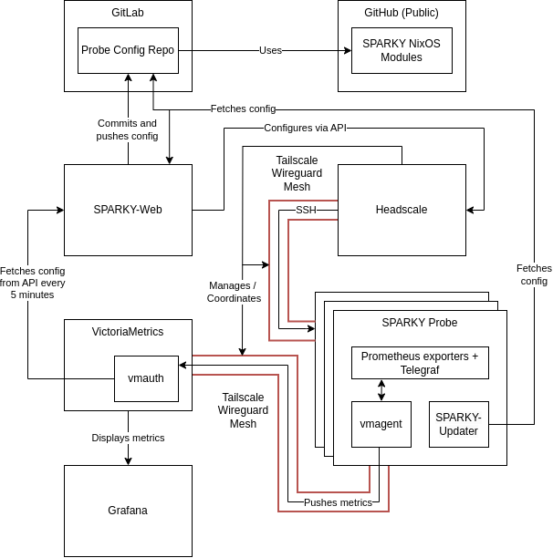

# SPARKY
SPARKY stands for *Service Performance Analysis (of) Reliability (and) (C|K)onnectivitY* and consists of Nix based probes that are connected to a Tailscale-Network and perform reliability and connectivity tests via Prometheus exporters.

## Usage concept
The idea behind SPARKY is that you have probes that can be deployed in POPs or also at customers' homes and perform reliability and connectivity tests from there.

The probes can perform the following tests:
- iperf3 (bandwidth limit can be configured)
- blackbox HTTP(s) tests
- traceroute tests
- smokeping tests

## Components
SPARKY consists of the following components:
- A [Headscale](https://headscale.net/) Tailscale control server
  - Must be reachable from the Probes over the public internet for setting up the Tailscale Wireguard mesh
- A [VictoriaMetrics](https://victoriametrics.com/) monitoring server
  - Connected to the probes via the Tailnet, so has not to be reachable from the public internet
- A [Grafana](https://grafana.com/) for visualization of the metrics
  - Not covered in these NixOS modules, has to reach the VictoriaMetrics server, but don't has to be reachable from the public internet
- A Python-Django based [webinterface](https://github.com/wobcom/sparky-web) for the management of the probes
  - Generates the NixOS configurations of the probes and pushes them to a probe config git repository on a given GitLab instance
  - Needs to be reachable from the public internet because the Probes use the API of the webinterface for their Zero-Touch-Provisioning
- A [GitLab](https://about.gitlab.com/) for the Git-Repository that contains the NixOS configs for the probes, which are generated by the webinterface
  - GitLab is required here, because these NixOS modules use the GitLab API for probe auto-updates and Zero-Touch-Provisioning
  - Can be a self-hosted GitLab or a repo on [gitlab.com](https://about.gitlab.com/) and the repo itself can (and should be) private
  - The GitLab must be reachable from the public internet so that the probes can access the GitLab API

## Infrastructure overview

## Setup of the infrastructure
### Prerequisites
Inside the Tailnet, the SPARKY-Infra uses a [RFC 4193](https://datatracker.ietf.org/doc/html/rfc4193) IPv6 ULA prefix. Such a prefix can for example be generated on [this website](https://unique-local-ipv6.com/).

The following instructions use `fd8f:89ae:ca73::/48` as an example for a random ULA prefix, but please generate a prefix random yourself.

Next, we pick 3 /64 subnets out of the prefix for the following networks:
- Management
  - `fd8f:89ae:ca73:1::/64`
  - Will contain the Headscale server itself, which will be a SSH Jump-Host to the probes
    - Example Headscale IP: `fd8f:89ae:ca73:1::1`
- Monitoring
  - `fd8f:89ae:ca73:2::/64`
  - Will contain the VictoriaMetrics server
    - Example VictoriaMetrics IP: `fd8f:89ae:ca73:2::1`
- Probes
  - `fd8f:89ae:ca73:3::/64`
  - Will contain all probes

### Headscale VM
Once you have your subnets, we can start setting up the Headscale VM. As described above, this VM has to be reachable from the public internet (or at least from the network where the probes are located in).

Set this VM up as a basic NixOS VM and then include the SPARKY-Modules and configure the SPARKY Headscale profile on the VM like in the [Headscale example](./docs/examples/infra/headscale.nix).

For the initial deployment, it is recommended to disable the `sparky-tailnet` profile since the headscale server needs to be configured first.

After the initial deployment, it is time to configure the Headscale (commands are executed as root on the Headscale VM):
- In the prerequisites-section, we picked the three networks for Managment, Monitoring and the Probes. Now we create Headscale users for those three "groups":
  - `headscale users create management`
  - `headscale users create monitoring`
  - `headscale users create probes`
- Next, create a PreAuthKey for the Headscale Host itself, so that the local tailscaled can join the new Tailnet
  - `headscale preauthkeys create -u management -e 1h`
  - Insert the PreAuthKey in the `sparky-tailnet` section of your NixOS config and then enable the `sparky-tailnet` profile on the Headscale VM
- Once the Headscale VM is deployed with the `sparky-tailnet` profile, you have to enable the route (the IP) of the Headscale Server in the Tailnet
  - List all announced routes
    - `headscale routes list`
  - Enable the route of the Headscale VM
    - `headscale routes enable -r [ID of the Route from the output above]`

### Probe config repo
See the [readme](./docs/examples/probe-repo/readme.md) of the example probe config repo for setup instructions.

### SPARKY-Web VM
As described above, this VM has to be reachable from the public internet (or at least from the network where the probes are located in).

Set this VM up as a basic NixOS VM and then include the SPARKY-Modules and configure the SPARKY-Web profile on the VM like in the [SPARKY-Web example](./docs/examples/infra/sparky-web.nix).

Note: the SPARKY-Web profile will configure a PostgreSQL 14 database on your VM, which is then used by SPARKY-Web.

SPARKY-Web requires many secrets, so here is a short guide on which secrets you need and how to get them:
- `secretKeyFile`
  - [Django secret key](https://docs.djangoproject.com/en/4.2/ref/settings/#secret-key)
  - Just generate a long random string, e.g. with `pwgen -s 64 1`
- `headscaleAPIKeyFile`
  - Headscale API key
  - Generate it on your Headscale VM with `headscale apikeys create -e 1y`
- `propeRepoSSHDeployPrivKeyFile`
  - Private key of the SSH keypair you have created in the previous section
- `propeRepoSSHDeployPubKeyFile`
  - Public key of the SSH keypair you have created in the previous section
- `probeRepoAccessTokenFile`
  - GitLab access token to the probe repo you have created in the previous section
  - **Make sure to replace this token before it expires each year**
- `metricsApiKeyFile`
  - API key for the VictoriaMetrics VM to fetch the [vmauth](https://docs.victoriametrics.com/vmauth.html) config from the webinterface (explained in the following VictoriaMetrics VM section)
  - Just generate a long random string, e.g. with `pwgen -s 64 1`

The [example config](./docs/examples/infra/sparky-web.nix) uses [sops](https://github.com/Mic92/sops-nix) to deploy the secrets to the VM. We have also provided an [example sops secrets file](./docs/examples/infra/example-web-sops.yaml) that you can use as a template.

The webinterface also supports LDAP authentication. If you want to use it, set `enableLdap = true` and provide a [django-auth-ldap](https://django-auth-ldap.readthedocs.io/en/stable/index.html) configuration. An example LDAP configuration can be found in the [example sops file](./docs/examples/infra/example-web-sops.yaml).

Once you have set up your webinterface, you can create a superuser by running `sparky-web-manage createsuperuser` on your VM. When you have done this, you can go to the django admin panel (https://sparky.example.com/admin/) to add your probe hardware profiles (to use the both included example profiles, use `s920` and `r2s` as the slugs).

### VictoriaMetrics VM
As described above, this VM is connected to the probes via the Tailnet, so it has not to be reachable from the public internet.

This VM consists of a VictoriaMetrics server and a `vmauth` auth proxy to ensure that a probe can only push metrics for itself and not for other probes (the `vmauth` assigns the `instance` prometheus label to the metrics). To do this, the `vmauth` has a bearer-token for each probe, which is provided from the SPARKY webinterface. The `vmagent` on the probes sends its metrics with its bearer token and then the `vmauth` knows which probe it is and assigns the `instance` label to the received metrics. This ensures that a compromised probe cannot manipulate the metrics of other probes.

This VM needs to be connected to the tailnet, so that the probes can send their metrics over it to the VM. For this, you need to generate a PreAuthKey for the VM to register it at the Headscale server. To generate the PreAuthKey, execute the following on the headscale server `headscale preauthkeys create -u monitoring -e 1h`. Then, you can use this key in the NixOS config of the VictoriaMetrics VM to set up the tailnet.

Set this VM up as a basic NixOS VM and then include the SPARKY-Modules and configure the SPARKY metrics profile on the VM like in the [VictoriaMetrics example](./docs/examples/infra/victoriametrics.nix).

Note: the `vmauth` requires at least one probe configured in the webinterface to start. So it is normal, that the `vmauth` unit fails to start on the first deployment, but it will fix itself once the first probe is added in the webinterface.

The metrics profile requires the `metricsApiKey` configured in the previous section as a secret. Also as in the previous section, this secret can be provided by using sops. We have again provided an [example sops secrets file](./docs/examples/infra/example-metrics-sops.yaml), which also includes an example `htaccess` file if you want to protect your VictoriaMetrics with that.

### Grafana dashboards
Once you have set up your VictoriaMetrics, you can add it to your Grafana as a prometheus data source. You can find some SPARKY Grafana dashboards in the [dashboards](./docs/dashboards/) directory.

## Probe setup
Now that you have set up the infrastructure, it is time to set up your first probes. This requires the following steps:

- Make sure that you have a hardware profile in your probe repo and the webinterface for the hardware you want to use for your probe
  - If not, a brief introduction into hardware profiles and how to create them was given in the [example probe repo](./docs/examples/probe-repo/readme.md)
- Create a ZTP image for the probe using the [build-ztp-image.sh script](./docs/examples/probe-repo/build-ztp-image.sh) in your probe repo for your hardware profile
- Flash the ZTP image on your SSD or SD card or whatever you use for your probe
- Register the probe in the webinterface with its MAC address (probe name and IP address are generated by the webinterface)
- Power on the probe with the ZTP image and connect it to the internet, so that it can perform the ZTP
- After the ZTP is done, the Probe should be marked as `online` in the webinterface
- Finally, you can enable the IP of the probe by clicking on the `disabled` next to it
- Then the probe should start pushing metrics to the VictoriaMetrics server

Note for the ZTP MAC addresses: some hardware, like the NanoPi R2S (for which we already included a hardware profile), does not have unique MAC addresses. For this, we have build a [SD-MAC module](./profiles/sparky-sd-mac/default.nix), which generates a MAC address based of the serial number of the SD card. To get the MAC address from a SD card, you can use the [generate-sd-mac.sh helper script](./docs/examples/probe-repo/generate-sd-mac.sh) from the probe repo to generate a MAC address from a SD card that is currently plugged in your computer.

Note: for security reasons, the ZTP API request with the probes' MAC address can only be made one time and every following request with this MAC address will be rejected. For that, the probe receives an API key with much more entropy than a MAC address, which it can then use in its following requests.

## Security measures
Since the probes may also be located in customers' homes and can be relatively easily unscrewed, particular care was taken in the design of this infrastructure to ensure that an attacker can cause as little damage as possible with a compromised probe:

- The only way to access a probe via SSH is over the Headscale VM
  - This is enforced by a local `nftables` rule on the probe and by the Headscale ACL
  - It is especially not possible to connect to the probe via SSH over its main IP it may received via DHCP in the customers' home
- The probes contains only the following secrets, which give an attacker the following possibilities:
  - Tailscale secrets:
    - With this, an attacker can connect their own computer to the tailnet
    - But in there, the attacker can only ping other probes and infrastructure and send metrics to the VictoriaMetrics server (but only for the compromised probe, see below)
    - This is enforced by the Headscale ACL (see below)
  - GitLab access token:
    - With this, an attacker can read the configs of the other probes and knows that they exist
    - But the attacker can not interact with the other probes exept for pinging them (enforced by the Headscale ACL)
    - Additionally, the repo contains the Headscale PreAuthKeys, but since they are only one time usable, an attacker can't do anything with those used keys (they are used immediately after the ZTP)
  - Metrics bearer token:
    - With this, an attacker can send fake metrics to the VictoriaMetrics over the tailnet
    - But since the `vmauth` assigns the `instance` label based on the bearer-token, it can only fake metrics for itself and not for other probes
  - API key for the webinterface:
    - With this, an attacker can request the current GitLab access token and the metrics bearer-token from the webinterface
    - As described in the previous two points, the attacker can't do anything special with these secrets
    - The API key can be revoked by deleting the API key in the webinterface

As already said, the [headscale profile](./profiles/sparky-headscale/default.nix) defines a Headscale ACL that strictily limits the possible connections in the tailnet. The only possible connections are:
- From any to any: ICMPv6
- From probes to VictoriaMetrics: port 80 TCP (for the metrics, HTTP because the traffic is already encrypted by the tailnet itself)
- From Headscale to probes: port 22 TCP
- Nothing else.